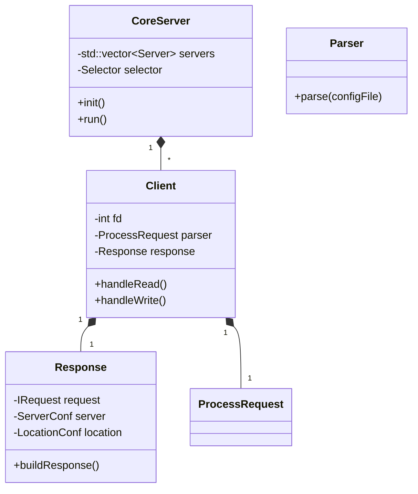

# Webserv Architecture

Webserv is a high-performance HTTP/1.1 server implemented in C++98. It follows a non-blocking, I/O multiplexing architecture to handle multiple concurrent connections efficiently.

## Core Components

### 1. I/O Multiplexing (Selector)
The server uses a `Selector` class (wrapping `poll` or `select`) to monitor multiple file descriptors (sockets) for readability and writability. This allows a single process to handle thousands of connections without the overhead of multi-threading for every request.

### 2. Core Server (`CoreServer`)
The `CoreServer` is the central orchestrator. It:
- Initializes the listening sockets for all configured ports.
- Manages the main event loop.
- Dispatches events to `Client` objects.

### 3. Client Management (`Client`)
Each connection is encapsulated in a `Client` object. It maintains the state of the connection, including:
- Buffered reading of requests.
- Buffered writing of responses.
- Association with specific virtual servers and locations based on headers.

### 4. Configuration System
- **`Parser`**: Reads `servIO.conf` and builds a hierarchy of configuration objects.
- **`MainConf`**: Top-level configuration (http block).
- **`ServerConf`**: Virtual server configuration (server block).
- **`LocationConf`**: Route-specific configuration (location block).

### 5. HTTP Protocol Logic
- **`ProcessRequest`**: Parses the raw HTTP request stream into `IRequest` objects.
- **`IRequest`**: Interface for different HTTP methods.
- **`Response`**: Generates HTTP responses, manages file I/O, and coordinates CGI execution.

## Request Lifecycle

1. **Accept**: `CoreServer` detects a new connection on a listening socket and creates a `Client`.
2. **Read**: `Client` reads data from the socket into a buffer.
3. **Parse**: `ProcessRequest` parses the buffer. Once the header is complete, it determines the `ServerConf` and `LocationConf`.
4. **Execute**: 
   - If it's a static file, `Response` reads it from disk.
   - If it's a CGI script, `Response` forks a child process and pipes the output.
   - If it's a directory, `Response` either serves the index file or generates an auto-index listing.
5. **Write**: `Response` prepares the raw HTTP response string (or file) and `Client` writes it back to the socket.
6. **Clean**: Once the response is sent, the connection is either kept alive or closed based on the `Connection` header and timeout.

## Class Diagram (Simplified)

